# Heart of Darkness (Windows) Technical Notes

<figure style="text-align: center;">
  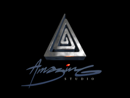
  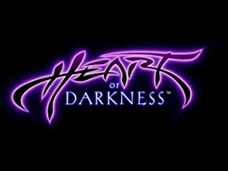
</figure>

Most of the information presented here was found by studying the binary
code and data files.


## Table of Contents

  1. [Assets](#assets)
  2. [Compression](#compression)
  3. [Debug Mode](#debug-mode)
  4. [Engine](#engine)
  5. [Savegame](#savegame)
  6. [Resolution](#resolution)
  7. [Shadows Rendering](#shadows-rendering)
  8. [Screen Transform Effect](#screen-transform-effect)
  9. [Sprite Blitting](#sprite-blitting)


## Assets

The options, menus and hint screens are stored in `SETUP.DAT`.

<figure style="text-align: center;">
  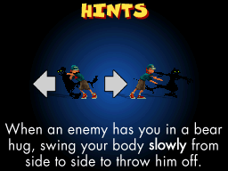
  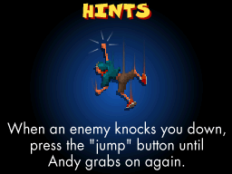
  <figcaption>Figure 1: Hint screens from the game</figcaption>
</figure>

Cinematics and menu transitions are stored in `HOD.PAF` ("Packed
Animation File").

For each level, there are three files suffixed with `_HOD`:
  - `.LVL` : contains palettes, bitmaps, sprites and pre-calculated
    tables for shadows
  - `.MST` : contains bytecode and triggers for the monster logic
  - `.SSS` : contains sounds (PCM), bytecode and triggers

Each file contains several C structures with pointers to binary data or
other structures.

The loading code typically casts the memory buffer read from the disk
to the C structure.

The pointer fields of the structure are then fixed in place. This is
possible since the size of pointer fits an `uint32_t`.

The same cannot be directly applied on more modern platforms with
64-bit processors, since casting the structure would result in a
different size. A recreation of the engine targetting big-endian
or 64-bit CPUs has to deserialize each structure field.


## Compression

The engine uses two different compression algorithms for graphics:

  - RLE for graphics decoded at runtime (sprites)
  - LZW for static bitmaps (menu, hints and level screen backgrounds)

Prepending a TIFF header to a LZW compressed data block makes it
possible to load the file in image editors without further changes.

<figure style="text-align: center;">
  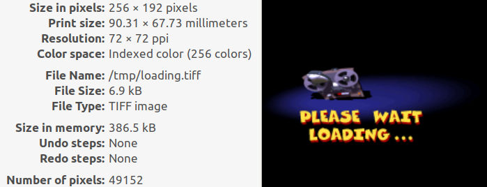
  <figcaption>Figure 1: Image details for the Loading screen</figcaption>
</figure>

Such programs indicate the compression is based on "Old style LZW codes"
(eg. the bitstream starts with a `0x100` clearcode). `libtiff` needs to
be compiled with `LZW_COMPAT` to handle such files.

```C++
// libtiff/tif_lzw.c
#ifdef LZW_COMPAT
  if (!sp->dec_decode) {
    TIFFWarningExt(tif->tif_clientdata, module, "Old-style LZW codes, convert file");
```

## Debug Mode

Pressing the left or right shift key when loading the quit confirmation
or a hint screen shows some statistics and debug information.

The first line (`Mem`, `Used`, `Free`) indicates the status of the memory
pool.

The second line lists the benchmark values for the hard drive, CDROM
and CPU.

The third line indicates if the hard drive (`HD`), CDROM (`CD`) or CPU are
considered slow. `LM` is 1 if the system is low on memory. `P` is 1 if
`.paf` animations are preloaded before playback.

The last line gives information about game state. `V` is the version of
the engine. `P` is the current level, `S` the current screen followed
by the state (each screen can hold 4 different states). `R` is the last
game checkpoint (restart?). `D` is the difficulty and `E` the last error
code.

<figure style="text-align: center;">
  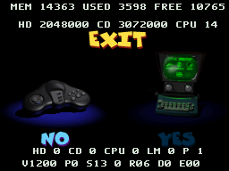
  <figcaption>Figure 3: Debug Mode</figcaption>
</figure>


## Engine

The engine code can be split into four major parts:
  
  - native code handling collision, path finding, sprites, rendering and
    game objects
  - native code for each level screen ([callbacks](#callbacks))
  - a bytecode interpreter (242 opcodes) for the monsters logic
  - a bytecode interpreter (30 opcodes) for sounds

### Callbacks

For each level and screen, the below callbacks can be found in the
executable.

```C++
// called before entering the screen
callLevel_preScreenUpdate(int screen)
```

```C++
// called to refresh the screen when it is current
callLevel_postScreenUpdate(int screen)
```

```C++
// called when starting the level from a checkpoint (setup objects)
callLevel_setupScreenCheckpoint(int screen)
```

```C++
// called at each engine tick
callLevel_tick()
```

```C++
// called when initializing and terminating the level (eg. play a cinematic)
callLevel_initialize()
callLevel_terminate()
```

These callbacks will usually:

  - keep track of the user progress (checkpoints)
  - update the background bitmap and state
  - update sprites and game objects

As an example, the first screen of the `rock` level has two different
states, one before and another one after the explosion.

<figure style="text-align: center;">
  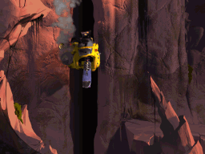
  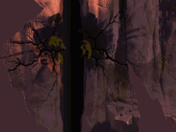
  <figcaption>Figure 4: The `rock` level before and after the transition</figcaption>
</figure>

The callback code relies on some state and counter variables to change
the asset for the background when Andy jumps:

```C++
void postScreenUpdateCb_rock_screen0() {
  if (_screens[0].state0 == 0) {
    // check for Andy jumping state
    if ((_andyObject->flags0 & 0x1F) == 0 && ((_andyObject->flags0 >> 5) & 7) == 6) {
      _screens[0].state0 = 2;
    }
  } else if (_screens[0].state0 == 2) {
    ++_screens[0].counter
    if (_screens[0].counter > 25) {
      _screens[0].s0 = 1
    }
    if (_screens[0].counter == 2) {
      shakeScreen(3, 12)
    }
  }
}

void preScreenUpdateCb_rock_screen0() {
  if (_screens[0].state0 == 0) {
    _screenBackground[0].currentId = 0
  } else {
    _screens[0].state0 = 1
    _screenBackground[0].currentId = 1
  }
}
```

### Monsters Logic

There is a bytecode interpreter for controlling the monsters in the game.
The interpreter can handle up to 64 concurrent tasks (coroutines).

The game state and coroutines can communicate via global vars (`40`),
32 bits flags or task local storage:

  - each task has 8 integers of local storage; `var[7]` holds a task
    identifier
  - each coroutine can be associated to a monster
  - each monster also has 8 integers of local storage; `var[7]` holds
    the energy

Using C structures, this corresponds to:

```C++
uint32_t _flags;
int32_t  _vars[40];

struct Task {
  const uint8_t *bytecode;
  Monster *monster;
  int32_t vars[8];
  uint8_t flags;
  ...
} _tasks[64];

struct Monster {
  int32_t vars[8];
  ...
};
```

Each opcode is 32 bits long stored as little-endian. The low byte contains
the opcode number, parameters are stored in the upper 3 bytes.

The 242 opcodes can be divided in 6 categories:

  - arithmetic on variables
  - monsters state, behavior and path finding
  - sprites
  - general game triggers (hints display)
  - tasks handling
  - bytecode control flow (`jmp`)


## Sounds

The engine has a bytecode interpreter dedicated to the sounds. The 30
opcodes can be divided in 3 categories:

  - volume and panning modulation
  - playback control (pause, resume, stop)
  - bytecode control flow (jump)

| Opcode | Name                              | Description                           |
|:------:|-----------------------------------|---------------------------------------|
|  `2`   | `addSound`                        |                                       |
|  `4`   | `removeSound`                     |                                       |
|  `5`   | `seekForward`                     | seek to the PCM frame                 |
|  `6`   | `repeatGreaterEqual`              |                                       |
|  `8`   | `seekBackwardDelay`               |                                       |
|  `9`   | `modulatePanning`                 | update sound panning value            |
|  `10`  | `modulateVolume`                  | update sound volume value             |
|  `11`  | `setVolume`                       | set sound volume value                |
|  `12`  | `removeSounds`                    | remove all matching sounds            |
|  `13`  | `initVolumeModulation`            | define steps and target volume         |
|  `14`  | `initPanningModulation`           | define steps and target panning        |
|  `16`  | `resumeSound`                     |                                       |
|  `17`  | `pauseSound`                      |                                       |
|  `18`  | `decrementRepeat`                 |                                       |
|  `19`  | `setPanning`                      | set sound panning value               |
|  `20`  | `setPauseCounter`                 |                                       |
|  `21`  | `decrementDelay`                  |                                       |
|  `22`  | `setDelay`                        |                                       |
|  `23`  | `decrementVolumeModulationSteps`  |                                       |
|  `24`  | `setVolumeModulationSteps`        |                                       |
|  `25`  | `decrementPanningModulationSteps` |                                       |
|  `26`  | `setPanningModulationSteps`       |                                       |
|  `27`  | `seekBackward`                    | seek to the PCM frame                 |
|  `28`  | `jump`                            | jump to a given offset in the bytecode |
|  `29`  | `end`                             |                                       |

Each opcode has variable length, from 4 to 16 bytes.

## Savegame

The engine does not allow saving the game state but tracks the last
level and checkpoint reached by the player. This is saved in the
`setup.cfg` file.

The file is 212 bytes long and contains the state for 4 different players:

  - each player state block is 52 bytes long and stored consecutively
  - at offset `209`: the current player index (0-3)
  - at offset `211`: checksum; a XOR of the previous 210 bytes

| Data          | Field                       | Notes                                   |
|:-------------:|-----------------------------|-----------------------------------------|
| `byte[10]`    |Last checkpoint reached      | Used to display a thumbnail in the menu |
| `byte`        |Current level                |                                         |
| `byte`        |Current checkpoint for level |                                         |
| `uint32_t`    |Bitmask of played cutscenes  | Used to allow replay from the menu      |
| `uint32_t[4]` |Joystick mapping             |                                         |
| `byte[8]`     |Keyboard mapping             |                                         |
| `byte[8]`     |Second Keyboard mapping      |                                         |
| `byte`        |Difficulty                    |                                         |
| `byte`        |Stereo sound                 |                                         |
| `byte`        |Sound volume                 |                                         |
| `byte`        |Last level reached           |                                         |

Integers are saved in little-endian byte order.


## Resolution

The internal resolution of the game is 256x192 pixels, which likely dates
back from the early years of development where graphics cards on PCs were
limited to 256 colors in 320x200 resolution ("mode `0x13`").

As the resolution would be too low for a game released in 1998, the
engine creates a 640x480 window and upscale the game screen buffer by two.

```asm
.text:004320E0    mov    eax, [esi+DirectXObjects.screen_display_h] # 640
.text:004320E6    mov    ecx, [esi+DirectXObjects.screen_display_w] # 480
.text:004320EC    sub    eax, 384
.text:004320F1    sub    ecx, 512
.text:004320F7    shr    eax, 1
.text:004320F9    imul   eax, [esi+DirectXObjects.screen_display_pitch]
.text:00432100    shr    ecx, 1
.text:00432102    add    eax, ecx
```

Nearest neighbor scaling is used for game graphics. The x86 code packs two
indexed pixels in one 32 bits register to optimize the copy.

```asm
.text:00432707    mov    al, [esi+1]
.text:0043270A    mov    bl, [esi+3]
.text:0043270D    mov    ah, al
.text:0043270F    mov    bh, bl
.text:00432711    shl    eax, 16
.text:00432714    shl    ebx, 16
.text:00432717    mov    al, [esi]
.text:00432719    mov    bl, [esi+2]
.text:0043271C    mov    ah, al
.text:0043271E    mov    bh, bl
.text:00432720    mov    [edi], eax
.text:00432722    mov    [edi+4], ebx
.text:00432725    mov    [ebp+0], eax
.text:00432728    mov    [ebp+4], ebx
```

The above block is repeated 64 * 192 times. In pseudo-code, this is equivalent to:

```C++
# input pixels : 0 1 2 3
eax = (esi[1] << 24) | (esi[1] << 16) | (esi[0] << 8) | esi[0]
// eax == 0 0 1 1
ebx = (esi[3] << 24) | (esi[3] << 16) | (esi[2] << 8) | esi[2]
// ebx == 2 2 3 3
# output pixels : 0 0 1 1 2 2 3 3
edi[0] = ebp[0] = eax
edi[4] = ebp[4] = ebx
// scanline0 == 0 0 1 1 2 2 3 3
// scanline1 == 0 0 1 1 2 2 3 3
```

Interestingly, while the most recent, the game has the smallest resolution
when compared with other games developed by the same group of people:

  - [Another World](https://www.mobygames.com/game/564/out-of-this-world/) (1991) is 320x200 16 colors
  - [Flashback](https://www.mobygames.com/game/555/flashback-the-quest-for-identity/) (1992) is 256x224 256 colors


## Shadows Rendering

The engine keeps two buffers for rendering: one for the static background
and another one to draw sprites and shadows.

<figure style="text-align: center;">
  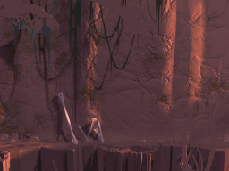
  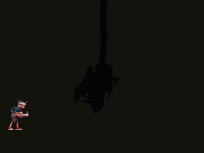
  <figcaption>Figure 5: The background and shadow buffers</figcaption>
</figure>

For each screen in the game, the data files contains some precalculated
tables used to render the shadows.

| Table              | Size                           | Comment                                           |
|--------------------|--------------------------------|---------------------------------------------------|
| `projectionData`   | `256 * 192 * sizeof(uint16_t)` | for a given `(x, y)` returns the casted `(x, y)`  |
| `paletteIndexData` | `256`                          | lookup the shadow color in current screen palette |

With these two tables, drawing the shadows is simply achieved by passing
the pixel palette indexes through these two LUTs.

```C++
for (i = 0; i < 256 * 192; ++i) {
  const int offset = projectionData[i]
  if (shadowLayer[offset] < 144) {
    frontLayer[i] = backgroundLayer[i]
  else {
    // shadow color, remap to game color
    frontLayer[i] = paletteIndexData[backgroundLayer[i]]
  }
}
```

<figure style="text-align: center;">
  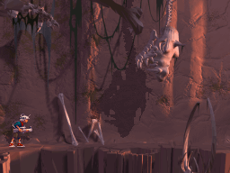
  <figcaption>Figure 6: The combined buffers as drawn to the screen</figcaption>
</figure>


## Screen Transform Effect

In some levels, the screen buffer is post processed to apply a water or
heat effect to the game graphics.

The executable contains two `256x193` bitmaps, where each pixel intensity
is used as an offset in the final buffer.

<figure style="text-align: center;">
  
  
  <figcaption>Figure 7: The displacement maps for the water and heat effects</figcaption>
</figure>

Transforming the game graphics screen is again done with a lookup table. `t`
is a variable incremented on each frame, wrapping to 0 when equal to 256
(eg. the screen width).

```C++
for (y = 0; y < 192; ++y) {
  for (x = 0; x < 256; ++x) {
    tx = x + tdata[t]
    transformLayer[y * 256 + x] = frontLayer[y * 256 + tx]
    ++t
  }
}
```

<figure style="text-align: center;">
  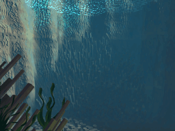
  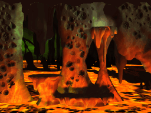
  <figcaption>Figure 8: Backgrounds with displacement effects applied</figcaption>
</figure>


## Sprite Blitting

Similar to Flashback, the sprites are not cached in RAM but decompressed
in realtime when drawn. The RLE code byte uses the upper two bits for the
operation type and the lower 6 bits for the length.

| Type | Operation   |
|:----:|-------------|
| `0`  | copy        |
| `1`  | repeat      |
| `2`  | transparent |
| `3`  | next line   |

Sprites can be vertically or horizontally flipped. The decoding routine
also handles clipping when a sprite is on a screen edge.

All these transformations are handled by the original engine using
jumptables. The index is a mask representing the clipping and flipping
to apply.

The first level of jumptables handles flipping and clipping; the second
level of jumptables handles the RLE code itself.

```asm
.text:0042F82F    mov    cl, 3Fh
.text:0042F831    lodsb
.text:0042F832    and    cl, al
.text:0042F834    jmp    off_440C50[eax*4]
```
